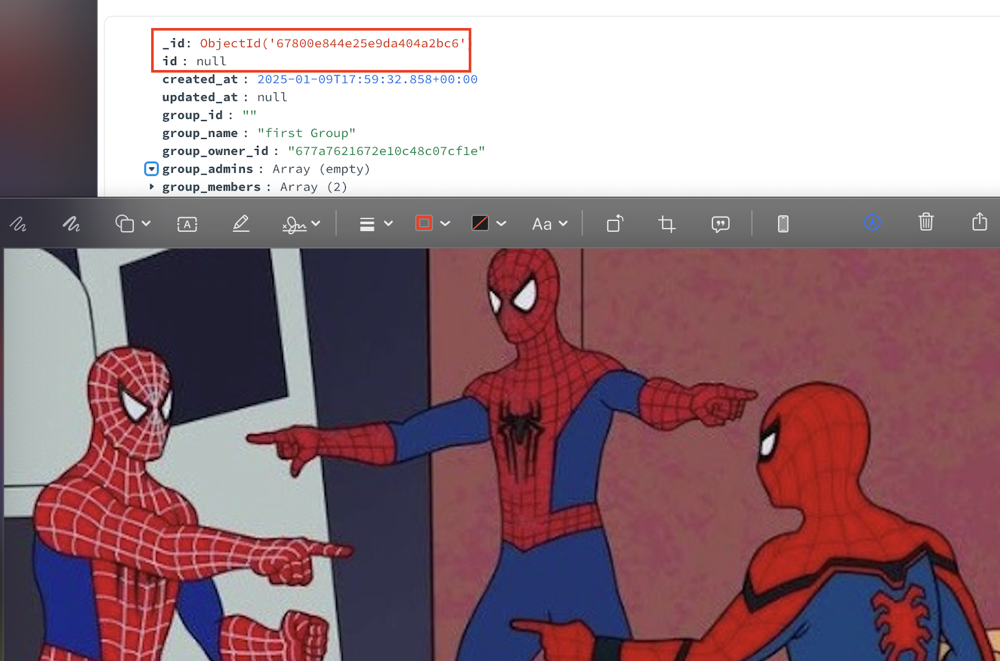

[//]: # (Will do readme later)

[//]: # (![Alt text]&#40;media/logo.jpeg&#41;)
[//]: # (![Alt text]&#40;media/placeholder.webp&#41;)

[//]: # (![Alt text]&#40;media/placeholder2.jpg&#41;)

[//]: # (I can't stop dividing everything into modules and then connecting them. I get a lot of pleasure from it.)
suffer
